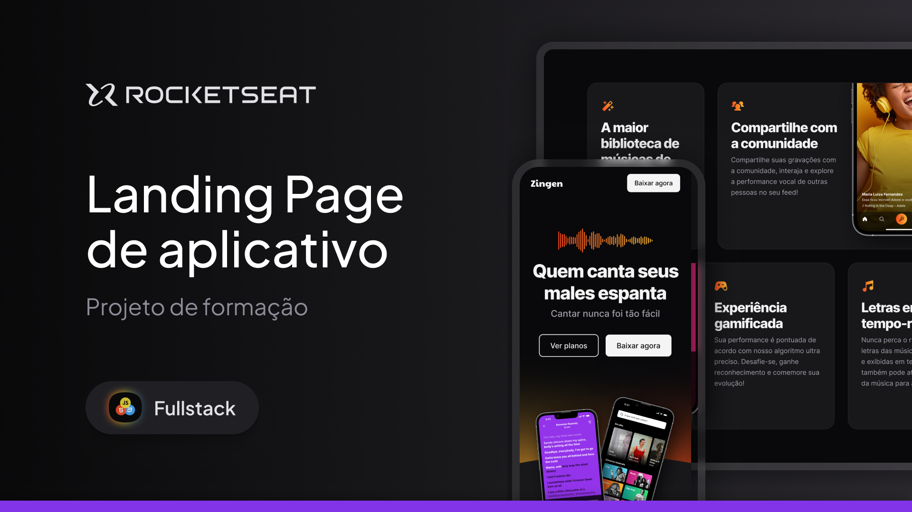

# 🎤 Zingen – Landing Page Responsiva

Este é um projeto de uma landing page responsiva para um aplicativo de Karaokê chamado **Zingen**.

Criado como parte do curso da [Rocketseat](https://www.rocketseat.com.br/), o projeto tem como objetivo apresentar o app ao público, detalhar seus diferenciais e incentivar o download.



---

## ✨ Funcionalidades

- Layout totalmente responsivo (desktop, tablet e mobile)  
- Navegação em âncoras entre seções (Header, Features, Preços, Download, Footer)  
- Cards de funcionalidades com ícones SVG  
- Seção de planos: Gratuito, Premium e Família  
- Imagens otimizadas para performance e responsividade

---

## 🚀 Tecnologias utilizadas

- HTML5  
- CSS3 (estruturado por módulos/arquivos por seção)  
- Google Fonts (família Inter)  
- Flexbox e Grid  
- SVGs e imagens PNG otimizadas

---

## 🧭 Como rodar localmente

1. Clone o repositório:
   ```bash
   git clone https://github.com/Joyce-Gomes/zingen-landing-page.git

2. Acesse o diretório:

cd zingen-landing-page

3. Abra o index.html no navegador ou através de Live Server no VS Code.

---

## 🌐 Deploy
Visualize o projeto aqui:
🏠 Deploy acesse o link (https://joyce-gomes.github.io/Zingen/)


## 🧠 Aprendizados

- Modularização do CSS por seções + utilitários
- Construção de layout responsivo sem framework
- Uso de SVGs para ícones vetoriais
- Estrutura semântica e clean do HTML

## 👩‍💻 Autora

- Desenvolvido por Joyce Gomes Santos

- GitHub: [Joyce‑Gomes](https://github.com/Joyce-Gomes)

- LinkedIn: [linkedin.com/in/joyce-gomes-santos](https://www.linkedin.com/in/joyce-gomes-santos/)

- E‑mail: (joy.gomessantos@gmail.com)


